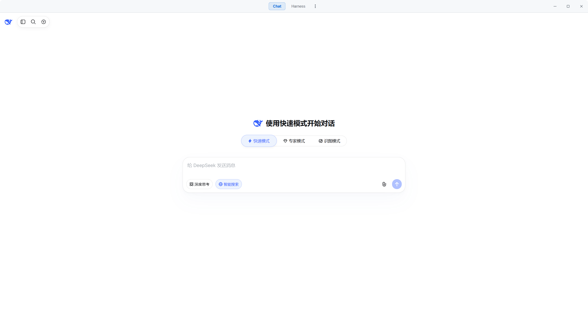
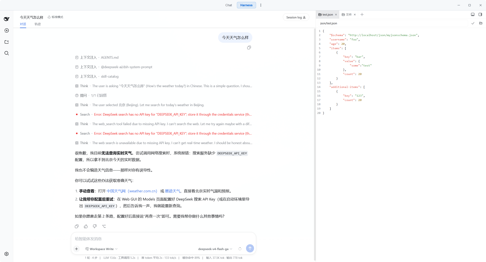
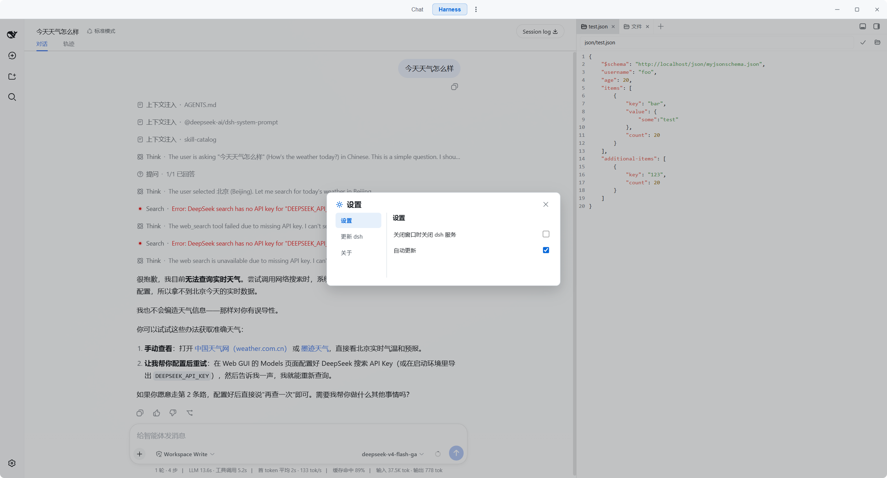

# DeepSeek Harness Desktop

把 [DeepSeek Harness](https://github.com/deepseek-ai/deepseek-harness)(dsh)Web 界面封装为原生 **Windows 桌面应用**的 Tauri v2 外壳。

## 截图







## 特色

- **原生桌面体验**:基于 Tauri v2(WebView2)，无浏览器地址栏、无系统菜单干扰。
- **自动启动 dsh 服务**:启动时自动执行 `npx @deepseek-ai/dsh web --port 3080`(可用 `DSH_PORT` 环境变量改端口)，加载完成后自动导航到 Harness 界面。
- **内置 DeepSeek Chat**:标题栏一键在 Harness 与官方 DeepSeek Chat 网页之间切换。
- **自定义标题栏**:可拖拽、窗口控制按钮、居中的导航与“更多”菜单。
- **更多菜单**:关闭 dsh、关闭 dsh + 窗口、重启 dsh、更新 dsh、关于。
- **更新能力**:“关于”中可检查更新并一键更新到最新版(从 GitHub Release 下载便携 exe 自动替换并重启)。
- **单实例**:重复启动会聚焦已有窗口。
- **全局快捷键**:`F12` 打开/关闭当前页面的 DevTools。

## 运行

### 前置条件

| 依赖 | 说明 |
|---|---|
| Windows 10/11 | 支持 x64 |
| [Node.js](https://nodejs.org/) ≥ 20 | 运行 dsh 服务所需 |
| [@deepseek-ai/dsh](https://www.npmjs.com/package/@deepseek-ai/dsh) | 全局安装:`npm install -g @deepseek-ai/dsh` |
| WebView2 | Windows 10/11 系统自带，无需额外安装 |

### 启动

- 方式一:直接运行构建产物 `publish\DeepSeekHarness.exe`。
- 方式二:开发运行 `cd src && npm run tauri dev`。

首次启动会自动安装并拉起 dsh 服务(如端口已被占用则直接复用现有服务)。关闭窗口只退出应用、保留 dsh 服务；如需一并关闭服务请使用“更多 → 关闭 dsh + 窗口”。

### 标题栏功能介绍

| 区域 | 功能 |
|---|---|
| DeepSeek Chat | 切换到官方 DeepSeek Chat 网页 |
| DeepSeek Harness | 切换到 dsh Harness 界面(默认) |
| 关闭dsh和窗口 | 停止 dsh 服务并退出应用 |
| 重启 dsh | 重启 dsh 服务并刷新界面 |
| 更新 dsh | 检查并更新全局 `@deepseek-ai/dsh`(npm) |
| 关于 | 查看当前桌面版本、检查更新、一键更新应用 |

## 构建

### 前置条件

| 依赖 | 说明 |
|---|---|
| [Node.js](https://nodejs.org/) ≥ 20 | 含 npm |
| [Rust](https://rustup.rs/)(MSVC toolchain) | `rustup default stable-x86_64-pc-windows-msvc` |
| 联网 | 拉取 cargo 依赖与 npm 依赖 |

> 本项目**只产出便携 exe，不生成安装包**。WebView2 运行时为系统自带，无需打包。

### 构建脚本调用

一键构建(推荐，与 CI 一致):

```bat
src\publish.bat
```

执行后会把便携版 `deepseek-harness.exe` 复制到 `publish\DeepSeekHarness.exe`，直接双击即可运行。

等价的手工命令:

```bash
cd src
npm install
npm run tauri build -- --no-bundle   # 产出 src\src-tauri\target\release\deepseek-harness.exe
```

## 插件推荐

dsh 通过 profile 管理插件，在 dsh web profile 中安装:

```bash
dsh plugin --profile web add <包名>
```

| 插件 | 说明 |
|---|---|
| [dshmarket](https://github.com/dsh-market/dsh-market) | dsh 内置的可视化插件市场:浏览、搜索、一键安装社区插件。 |
| [dsh-liquid-glass](https://github.com/xingyingyuzhui/dsh-liquid-glass) | 为 Harness 添加壁纸与“液态玻璃”(Liquid Glass)叠加视觉效果，兼容官方浅色 / 深色 / 跟随系统主题。 |
| [dsh-better-sidebar](https://github.com/omdsh-dev/DSH-better-sidebar) | VSCode 风格的右侧栏(资源管理器 / 编辑器 / 终端 / Git / 浏览器)，按会话隔离，并暴露服务供其他插件注册侧栏页与文件查看器。 |

## License

[MIT](LICENSE)
